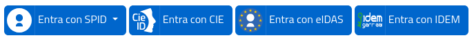

# ita-button


Il progetto nasce dall'esigenza di poter utilizzare i bottoni per le autenticazioni SPID / CIE / eIDAS / IDEM ed eduGAIN con siti "non bootstrap 4' senza reinventare la ruota.

Il progetto non è AGID e non sostituisce il bottone ufficiale [spid-sp-access-button](https://github.com/italia/spid-sp-access-button), il progetto si prefige soltanto di provare ad ottenere un risultato simile con un codice più semplice e generico.

## Obiettivi
* creare un set di bottoni indipendente da ogni framework css
* creare uno standard unico compatibile con i vari bottoni (SPID / CIE / ecc.)
* non richiedere js per il funzionamento del bottone
* supportare l'inserimento statico delle voci di dropdown (idps SPID)
* supportare l'inserimento dinamico delle voci di dropdown via js (idps SPID circ. 41)
* creare un css il più  piccolo possibile
* mantenere un elevato livello di coerenza indipendentemente dal framesowrk css utilizzato

## Filosofia nella creazione del progetto
* Utilizzare soltanto dimensioni relative (em o rem) per rendere i bottoni coerenti con il resto del sito;
* Facilitare l'utilizzo limitando al minimo il numero dei tag necessari alla struttura;
* Non richiamare asset dal css per non limitare i programmatori nella posizione degli asset;
* Eliminare il rischio di conflitti tra classi CSS definendo gli stili a partire da un contenitore principale `ita` ed aggiungendo il prefisso `ita-` a tutte le classi del progetto;
* Gestire tutte le classi opzionali di configurazione nel contenitore printipale;
* Non vincolare le classi ad elementi specifici (es: a, button, span);
* Sviluppare con usabilità ed accessibilità in testa.

## Pagine di esempio
* [src/index.html](src/index.html) tutte le varianti di bottoni senza alcun framework css
* [src/index-bootstrap.html](src/index-bootstrap.html) Pagina di esempio con Bootstrap 5
* [src/index-bulma.html](src/index-bulma.html) Pagina di esempio con Bulma
* [src/index-tailwind.html](src/index-tailwind.html) Pagina di esempio con tailwind

## Struttura dei bottoni
Ogni bottone è composto da una classe contenitore principale `ita` con all'interno un elemento `ita-button` che contiene l'immagine ed il testo del bottone.
Il contenitore principale può opzionalmente avere al suo interno un elemento `ita-menu` con il contenuto del menù dropdown.

### Bottone semplice (privo di dropdown)
```html
<div class='ita'>
  <a class="ita-button" href="#">
    
    Entra con CIE
  </a>
</div>
```
### Bottone con dropdown
```html
    <div class='ita ita-dropdown'>
      <button class="ita-button">
	
	Entra con SPID
      </button>
      <div class='ita-menu' role='menu'>
        <a href="#"></a>
      </div>
    </div>
```
L'elemento `ita-menu` è nascosto (`display: hidden`) se il bottone o la classe stessa non sono in focus o il contenitore non è in hover. E' possibile forzare la visibilità aggiungendo la classe `ita-active` alla classe contenitore.
```html
<div class='ita ita-dropdown ita-active'>...</div>
```

### Classi opzionali
* **ita-fixed** fissa la larghezza dei bottoni a 10.4em (lunghezza del bottone spid)
* **ita-hover** rende il dropdown visibile al passaggio del mouse
* **ita-l** Bottone ridimensionato con i font impostati a 1.5rem
* **ita-xl** Bottone ridimensionato con i font impostati a 2rem
* **ita-xxl** Bottone ridimensionato con i font impostati a 2.5rem
* **ita-xxxl** Bottone ridimensionato con i font impostati a 3rem
* **ita-m05** Aggiunge un margine di 0.5rem al bottone
* **ita-mb05** Aggiunge margin-botton di 0.5rem al bottone
* **ita-mt05** Aggiunge margin-top di 0.5rem al bottone

### Informazioni specifiche per i vari bottoni
* [CIE](./cie.md)
* [eIDAS](./eidas.md)
* [IDEM](./idem.md)
* [SPID](./spid.md)

### Informazioni per il caricamento remoto degli idp 
Il repository contiene [ita.js](src/js/ita.js) una versione modificata del file [spid-idps.js](https://github.com/italia/spid-sp-access-button/blob/master/src/production/js/spid-idps.js) di [spid-sp-button](https://github.com/italia/spid-sp-access-button). Lo script è stato adattato alla struttura di questa versione dei bottoni, è stato rinchiuso in un modulo importabile ed è stato reso completamente configurabile.
* [spid-idps.js sorgente](src/js/ita.js)
* [spid-idps.js istruzioni e configurazione](./ita-js.md)

E' presente anche la prima versione del js inclusa in una classe invece che di un modulo
* [spid-idps.js sorgente](src/js/ita.js)
* [spid-idps.js istruzioni e configurazione](./spid-idps.md)

## CSS e font ##
Tutte le definizione dei bottoni sono inserite nel file [ita.sass](src/css/ita.css) generato dal file [ita.sass](src/css/ita.sass). E' possibile caricari il css nel proprio sito aggiungendo il seguente tag all'interno dell'header della  pagina:
```
<head>
  ...
  <link rel="stylesheet" href="css/ita.css" />
</head>
```

Il  font Titilium Web è il font tipografico istituzionale per l'italia, in ita-button è considerata una dipendenza esterna non obbligatori (non è richiamato dal css) in quanto non sussiste obbligo d'uso.
I bottoni in sequenza utilizzano i seguenti font family in sequenza: "Titillium Web", "HelveticaNeue", "Helvetica Neue", "Helvetica", "Arial", "Lucida Grande", "sans-serif". E' comunque possibile personalizzare i font dei bottoni modificando la variabile $fonts in [ita.sass](src/css/ita.sass).

Nella directory css è disponibile il file aggiuntivo [ita-font.css](src/css/ita-font.css) che permette di caricare il font [Titilium Web regular](src/css/titillium-web-v4-latin-regular.woff2) disponibile sempre nella directory [src/css](src/css). Per caricare il font aggiungere il seguente codince nell'head della pagina

```
<head>
  ...
  <link rel="stylesheet" href="css/font.css" />
</head>
```

## Personalizzazione SASS ##
Tramite il file [ita.sass](src/css/ita.sass) è possibile creare nuove varianti di colore dei bottoni popolando la variabile  $colors.

Per esempio popolando la cariabile con i seguenti valori si creeranno le classi `ita-orange` e `ita-black` con i colori memorizzati
```
$colors: (orange: #d77e29, black: #000)
```
Altre variabili configurabili sono:
* $ita-bg: Background di default 
* $light: background hover
* $gray: Grigio utilizzato per i bordi
* $radius: radius bordi dei bottoni
* $margin: Margine di default
* $fonts: font per i bottoni

## Crediti
* il sistema di importazione degli IDPS è ripreso dal progetto [Satosa-Saml2SPID](https://github.com/italia/Satosa-Saml2Spid/) ed è aggiornato con il nuovo sistema definito da [spid-sp-button](https://github.com/italia/spid-sp-access-button) in [spid-idps.js](https://github.com/italia/spid-sp-access-button/blob/master/src/production/js/spid-idps.js)
