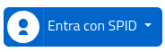

# SPID

```html
<div class='ita ita-dropdown'>
  <button class="ita-button">
    
    Entra con SPID
  </button>
  <div class='ita-menu' role='menu'>
    <a href="#"></a>
    ...
    <a href="https://www.spid.gov.it/serve-aiuto">Serve aiuto?</a>
  </div>
</div>
```

Bottone con dropdown dropdown. L'immagine disponibile in [src/img/spid.svg](src/img/spid.svg) è stata presa dal repositori [spid-sp-access-button](https://github.com/italia/spid-sp-access-button).
L'immagine non è stata alterata in quanto già era disponibile con rapporto 1:1.

Essendo un dropdown e non un link si consiglia di utilizzare il tag `button` per la classe `ita-button`.

Per manenere un adeguato standard di accessibilità è importante aggiungere la chiave `alt` all'icona e di inserire il `role="menu"` al tag `ita-menu`.

Per mantenere il risultato omogeneo allo standard SPID, si deve utilizzare `Entra con SPID` come testo del link.

Per produrre un dropdown simile a quello di [spid-sp-access-button](https://github.com/italia/spid-sp-access-button) è necessario inserire unicamente tag `a` contenenti immagini o testi nel div `.ita-menu`

## Caricamento remoto degli IDPS
Nel repository è disponibile il javascript (ita.js)[src/js/spid-idps.js] che assorbe a questa funzione. Per caricarlo bisogna aggiungere la seguente riga nell'header della pagina:
```html
<script src="js/spid-idps.js"></script>
<script>var spid_idps = new SpidIdps</script>
```
ed aggiungere la chiave `data-spid-remote` all'emelento `.ita-menu` che deve essere popolato.
```html
<div class='ita ita-dropdown'>
  <button class="ita-button">
    
    Entra con SPID
  </button>
  <div class='ita-menu' role='menu' data-spid-remote></div>
</div>
```
Maggiori informazioni riguardo il caricamento remoto degli IDPS sono disponibili ne file [spid-idps.md](spid-idps.md)
